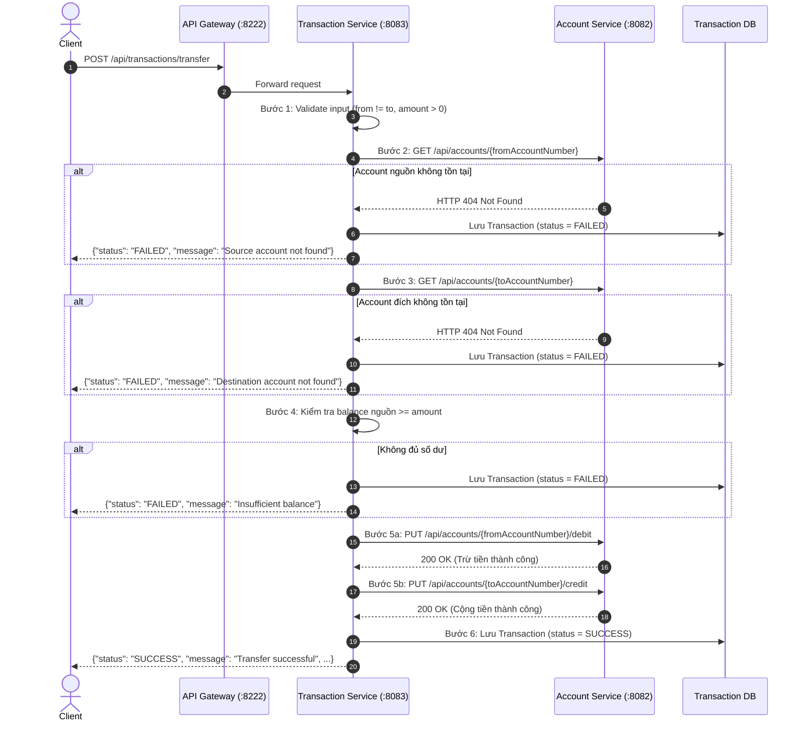

# BÀI TẬP TỔNG HỢP 3: GIAO TIẾP ĐỒNG BỘ GIỮA CÁC MICROSERVICE BẰNG RESTTEMPLATE

---

## 1. Mục tiêu bài tập
* Nắm vững cơ chế **giao tiếp đồng bộ (Synchronous Communication)** giữa các Microservice trong hệ sinh thái Spring Cloud.
* Sử dụng **RestTemplate** kết hợp annotation `@LoadBalanced` để gửi request HTTP giữa các service thông qua **Eureka Service Discovery** mà không cần hard-code IP/port.
* Cung cấp trọn vẹn nghiệp vụ quản lý tài khoản trên **Account Service** (truy vấn thông tin, kiểm tra số dư, trừ tiền `debit`, cộng tiền `credit`).
* Hiện thực hóa quy trình chuyển tiền (Money Transfer) 7 bước trên **Transaction Service** bảo toàn tính toàn vẹn dữ liệu, kiểm tra tài khoản, kiểm tra số dư và ghi nhận lịch sử giao dịch.
* Xử lý triệt để các ngoại lệ phổ biến (`HttpClientErrorException`, `ResourceAccessException`) khi service đích gặp lỗi hoặc tạm thời không khả dụng, trả về thông báo rõ ràng cho Client.
* Định tuyến toàn bộ các yêu cầu của Client qua **Spring Cloud API Gateway** trên cổng `8222`.

---

## 2. Kiến trúc hệ thống

```text
Client (Postman / Browser)
           |
           v (Request qua cổng 8222)
   +-----------------------+
   |   API Gateway :8222   |
   +-----------------------+
       |               |
       | /api/trans... | /api/accounts...
       v               v
+---------------------+   +---------------------+
| Transaction Service |   |   Account Service   |
|     (Port: 8083)    |   |     (Port: 8082)    |
+---------------------+   +---------------------+
       |                             ^
       |                             |
       +----- @LoadBalanced ---------+
       |      RestTemplate           |
       |      (http://account-service)
       v
+---------------------+
|    Eureka Server    |
|     (Port: 8761)    |
+---------------------+
```

---

## 3. Giải thích Synchronous Communication (Giao tiếp đồng bộ)
* **Khái niệm:** Trong giao tiếp đồng bộ (Synchronous Communication), bên gọi (Transaction Service) gửi một request HTTP đến bên nhận (Account Service) và **chờ phản hồi (blocking/waiting)** trước khi có thể tiếp tục thực hiện các bước tiếp theo trong quy trình.
* **Đặc điểm:**
  * Thích hợp cho các quy trình nghiệp vụ yêu cầu tính tức thời và kết quả phản hồi ngay lập tức (ví dụ: cần xác nhận số dư tài khoản có đủ tiền hay không trước khi thực hiện chuyển tiền).
  * Đơn giản, dễ theo dõi luồng xử lý và gỡ lỗi.
  * Nhược điểm là phụ thuộc chặt chẽ vào độ sẵn sàng và độ trễ của service đích (nếu Account Service phản hồi chậm hoặc bị chết, Transaction Service sẽ bị ảnh hưởng, do đó cần xử lý ngoại lệ cẩn thận).

---

## 4. Giải thích RestTemplate
* `RestTemplate` là HTTP client đa năng được Spring Framework cung cấp để thực hiện các yêu cầu HTTP (GET, POST, PUT, DELETE,...) và tự động chuyển đổi giữa JSON payload và Java Object.
* Các phương thức chính được sử dụng trong bài:
  * `getForObject(url, ResponseType.class)`: Gửi HTTP GET và deserialize body trả về thành object (ví dụ: lấy thông tin tài khoản).
  * `exchange(url, HttpMethod.PUT, httpEntity, ResponseType.class)`: Gửi HTTP PUT với request body và nhận về `ResponseEntity` để kiểm tra mã trạng thái HTTP (ví dụ: thực hiện `debit` và `credit`).

---

## 5. Giải thích Annotation `@LoadBalanced`
* Khi đánh dấu `@Bean @LoadBalanced` trên `RestTemplate`:
  ```java
  @Configuration
  public class AppConfig {
      @Bean
      @LoadBalanced
      public RestTemplate restTemplate() {
          return new RestTemplate();
      }
  }
  ```
* **Cơ chế hoạt động:**
  1. Spring Cloud sẽ gắn thêm một interceptor (`LoadBalancerInterceptor`) vào `RestTemplate`.
  2. Khi `RestTemplate` chuẩn bị gửi request với URI chứa hostname là tên service (ví dụ: `http://account-service/...`), interceptor sẽ chặn request lại.
  3. Interceptor chuyển tên `account-service` tới Spring Cloud LoadBalancer để tra cứu danh sách các instance đang hoạt động được đăng ký trong Eureka Server.
  4. LoadBalancer chọn một instance theo thuật toán (mặc định là Round Robin) và thay thế tên service bằng địa chỉ IP/port thực tế của instance đó (ví dụ: `http://192.168.1.10:8082/...`).
  5. Request sau đó mới thực sự được gửi tới instance đích.

---

## 6. Vì sao dùng `http://account-service/...` thay vì `http://localhost:8082/...`?

| Tiêu chí | Dùng `http://localhost:8082` (Hard-code) | Dùng `http://account-service` (Service Discovery) |
| :--- | :--- | :--- |
| **Phụ thuộc môi trường** | Bị gắn chặt vào máy local, triển khai lên Docker/K8s/Cloud sẽ lỗi ngay lập tức. | Hoàn toàn độc lập môi trường, tự tìm IP/port do service tự đăng ký với Eureka. |
| **Khả năng Scale Out** | Chỉ gọi được duy nhất 1 cổng cố định (8082), không tận dụng được khi chạy nhiều instance (8092, 8102,...). | Tự động cân bằng tải (Round Robin) phân phối đều lượng request qua tất cả các instance. |
| **Khả năng chịu lỗi (Fault Tolerance)** | Nếu port 8082 gặp sự cố, toàn bộ giao dịch sụp đổ dù có instance khác đang hoạt động. | Tự động loại bỏ instance gặp sự cố khỏi danh sách và định tuyến sang instance lành lặn. |

---

## 7. Quy trình xử lý chuyển tiền (Flow Transfer - 7 bước)



* **Bước 1 — Nhận request & Validate sơ bộ:** Nhận `TransferRequest`. Kiểm tra không rỗng, `amount > 0`, tài khoản gửi khác tài khoản nhận.
* **Bước 2 — Kiểm tra tài khoản nguồn:** Gọi `GET http://account-service/api/accounts/{fromAccountNumber}`. Nếu không tồn tại: Ghi nhận FAILED `"Source account not found"` và dừng lại.
* **Bước 3 — Kiểm tra tài khoản đích:** Gọi `GET http://account-service/api/accounts/{toAccountNumber}`. Nếu không tồn tại: Ghi nhận FAILED `"Destination account not found"` và dừng lại.
* **Bước 4 — So khớp số dư:** So sánh số dư tài khoản nguồn với `amount`. Nếu nhỏ hơn: Ghi nhận FAILED `"Insufficient balance"` và dừng lại (tuyệt đối không trừ tiền).
* **Bước 5 — Trừ tiền và Cộng tiền:**
  * Gọi `PUT http://account-service/api/accounts/{fromAccountNumber}/debit` với số tiền `amount`.
  * Gọi `PUT http://account-service/api/accounts/{toAccountNumber}/credit` với số tiền `amount`.
* **Bước 6 — Lưu giao dịch thành công:** Lưu record vào database với `status = SUCCESS`, trả về mã giao dịch và thông báo thành công cho Client.
* **Bước 7 — Xử lý khi có sự cố:** Bất kỳ lỗi nào phát sinh đều được lưu lại với `status = FAILED` kèm chi tiết lỗi và thông báo an toàn cho Client.

---

## 8. Danh sách API hệ thống

Tất cả các API được gọi thông qua API Gateway: `http://localhost:8222`

### 8.1. Account Service (Định tuyến: `/api/accounts/**`)
| STT | Phương thức | Endpoint qua Gateway | Mô tả | Body mẫu |
| :--- | :--- | :--- | :--- | :--- |
| 1 | `GET` | `/api/accounts/1001` | Lấy chi tiết thông tin tài khoản | *(Không có)* |
| 2 | `GET` | `/api/accounts/1001/balance` | Lấy số dư tài khoản | *(Không có)* |
| 3 | `PUT` | `/api/accounts/1001/debit` | Trừ tiền khỏi tài khoản | `{"amount": 2000000}` |
| 4 | `PUT` | `/api/accounts/1002/credit` | Cộng tiền vào tài khoản | `{"amount": 2000000}` |
| 5 | `GET` | `/api/accounts/info` | Kiểm tra port instance xử lý (Load Balancing) | *(Không có)* |
| 6 | `GET` | `/api/accounts` | Lấy danh sách toàn bộ tài khoản | *(Không có)* |

### 8.2. Transaction Service (Định tuyến: `/api/transactions/**`)
| STT | Phương thức | Endpoint qua Gateway | Mô tả | Body mẫu |
| :--- | :--- | :--- | :--- | :--- |
| 1 | `POST` | `/api/transactions/transfer` | Thực hiện chuyển tiền giữa 2 tài khoản | `{"fromAccountNumber":"1001","toAccountNumber":"1002","amount":2000000,"description":"Chuyen tien"}` |
| 2 | `GET` | `/api/transactions` | Xem lịch sử toàn bộ các giao dịch | *(Không có)* |
| 3 | `GET` | `/api/transactions/{id}` | Tra cứu chi tiết một giao dịch theo ID | *(Không có)* |

---

## 9. Hướng dẫn khởi chạy các Service

Mở các cửa sổ PowerShell riêng biệt tại thư mục `d:\SS07\Bai03` và chạy theo đúng thứ tự sau:

### Cửa sổ 1: Khởi động Eureka Server (Port 8761)
```powershell
cd d:\SS07\Bai03\eureka-server
.\gradlew bootRun
```

### Cửa sổ 2: Khởi động API Gateway (Port 8222)
```powershell
cd d:\SS07\Bai03\api-gateway
.\gradlew bootRun
```

### Cửa sổ 3: Khởi động Account Service (Port 8082)
```powershell
cd d:\SS07\Bai03\account-service
.\gradlew bootRun
```

### Cửa sổ 4: Khởi động Transaction Service (Port 8083)
```powershell
cd d:\SS07\Bai03\transaction-service
.\gradlew bootRun
```

> **Mẹo:** Dữ liệu mẫu đã được nạp sẵn khi Account Service khởi động:
> * Tài khoản `1001`: `10,000,000 VND`
> * Tài khoản `1002`: `5,000,000 VND`

---

## 10. Các Request Postman kiểm thử chi tiết

### 10.1. Kiểm tra tài khoản ban đầu
* **Request:** `GET http://localhost:8222/api/accounts/1001`
  * **Response:**
    ```json
    {
      "accountNumber": "1001",
      "balance": 10000000.0
    }
    ```
* **Request:** `GET http://localhost:8222/api/accounts/1002/balance`
  * **Response:**
    ```json
    {
      "accountNumber": "1002",
      "balance": 5000000.0
    }
    ```

---

## 11. Kết quả kiểm thử 3 Test Case chính

### 11.1. TEST CASE 1: Chuyển tiền thành công
* **Request:** `POST http://localhost:8222/api/transactions/transfer`
* **Headers:** `Content-Type: application/json`
* **Body:**
  ```json
  {
    "fromAccountNumber": "1001",
    "toAccountNumber": "1002",
    "amount": 2000000,
    "description": "Chuyển tiền thanh toán hóa đơn"
  }
  ```
* **Kết quả mong đợi:**
  ```json
  {
    "status": "SUCCESS",
    "message": "Transfer successful",
    "transactionId": 1,
    "fromAccountNumber": "1001",
    "toAccountNumber": "1002",
    "amount": 2000000.0
  }
  ```
* **Kiểm tra lại số dư tài khoản:**
  * `GET http://localhost:8222/api/accounts/1001/balance` $\rightarrow$ `balance = 8000000.0`
  * `GET http://localhost:8222/api/accounts/1002/balance` $\rightarrow$ `balance = 7000000.0`

---

### 11.2. TEST CASE 2: Không đủ số dư
* **Request:** `POST http://localhost:8222/api/transactions/transfer`
* **Body:**
  ```json
  {
    "fromAccountNumber": "1001",
    "toAccountNumber": "1002",
    "amount": 100000000,
    "description": "Test insufficient balance"
  }
  ```
* **Kết quả mong đợi:**
  ```json
  {
    "status": "FAILED",
    "message": "Insufficient balance"
  }
  ```
* **Kiểm tra lại số dư:** Số dư của cả `1001` (8,000,000) và `1002` (7,000,000) giữ nguyên không đổi.

---

### 11.3. TEST CASE 3: Tài khoản đích không tồn tại
* **Request:** `POST http://localhost:8222/api/transactions/transfer`
* **Body:**
  ```json
  {
    "fromAccountNumber": "1001",
    "toAccountNumber": "9999",
    "amount": 1000000,
    "description": "Test account not found"
  }
  ```
* **Kết quả mong đợi:**
  ```json
  {
    "status": "FAILED",
    "message": "Destination account not found"
  }
  ```
* **Kiểm tra lại số dư:** Tài khoản `1001` hoàn toàn không bị trừ tiền.

---

## 12. Cách kiểm tra Eureka Dashboard
1. Mở trình duyệt truy cập: `http://localhost:8761`
2. Tại bảng **Instances currently registered with Eureka**, kiểm tra thấy ít nhất 3 dịch vụ:
   * `ACCOUNT-SERVICE` (cổng 8082)
   * `TRANSACTION-SERVICE` (cổng 8083)
   * `API-GATEWAY` (cổng 8222)
   *(và `CUSTOMER-SERVICE` nếu khởi động)*
3. Trạng thái của các service phải hiển thị là `UP (1)`.

---

## 13. Các lỗi và ngoại lệ đã xử lý

1. **Lỗi tài khoản không tồn tại (`AccountNotFoundException`):**
   * Account Service trả về mã HTTP `404 Not Found` kèm JSON thông báo.
   * Transaction Service bắt ngoại lệ `HttpClientErrorException.NotFound` từ RestTemplate và trả về thông báo rõ ràng cho Client (`Source account not found` hoặc `Destination account not found`).
2. **Lỗi không đủ số dư (`InsufficientBalanceException`):**
   * Được kiểm tra ngay trước khi gọi debit, ngăn chặn số dư âm và trả về `Insufficient balance`.
3. **Lỗi số tiền không hợp lệ (`InvalidAmountException`):**
   * Ngăn chặn các số tiền $\le 0$ hoặc null.
4. **Lỗi tài khoản nguồn trùng tài khoản đích:**
   * Trả về `Source and destination accounts must be different`.
5. **Lỗi Account Service ngừng hoạt động (`ResourceAccessException`):**
   * Khi Account Service bị sập hoặc ngắt kết nối mạng, RestTemplate ném `ResourceAccessException`.
   * Transaction Service bắt ngoại lệ này, không để crash ứng dụng mà trả về thông báo thân thiện:
     ```json
     {
       "status": "FAILED",
       "message": "Account Service is unavailable"
     }
     ```
6. **Lưu lịch sử giao dịch thất bại:**
   * Mọi giao dịch bị lỗi (thiếu số dư, sai tài khoản, service ngắt kết nối) đều được ghi nhận vào database với trạng thái `FAILED` kèm lý do lỗi để phục vụ đối soát và kiểm toán.
